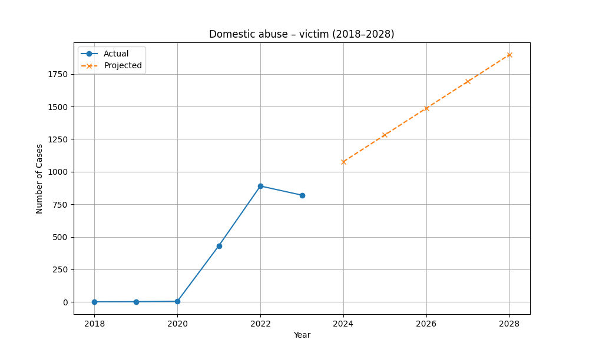
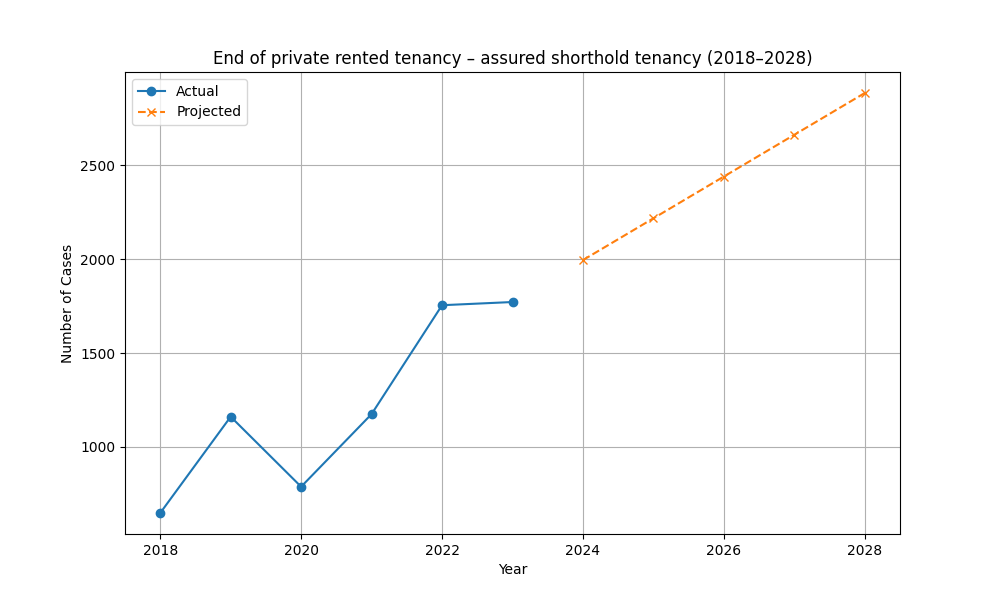
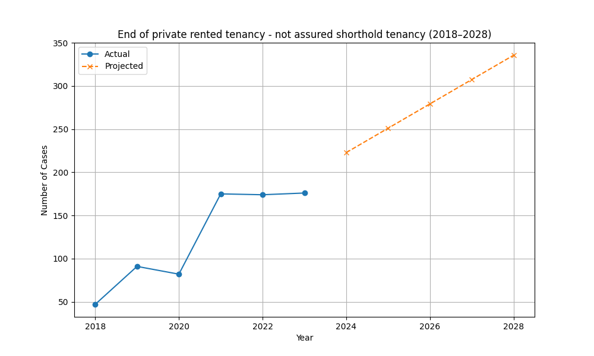
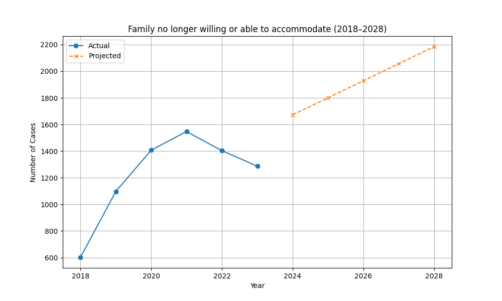
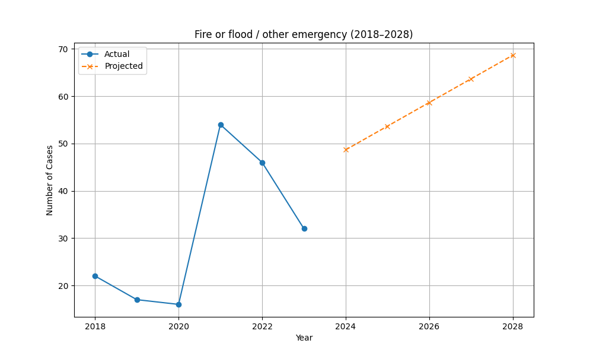
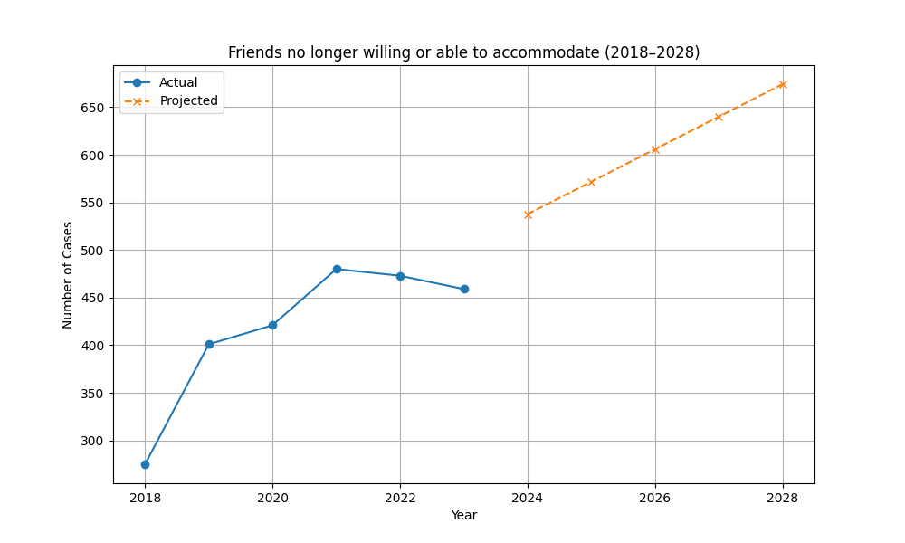
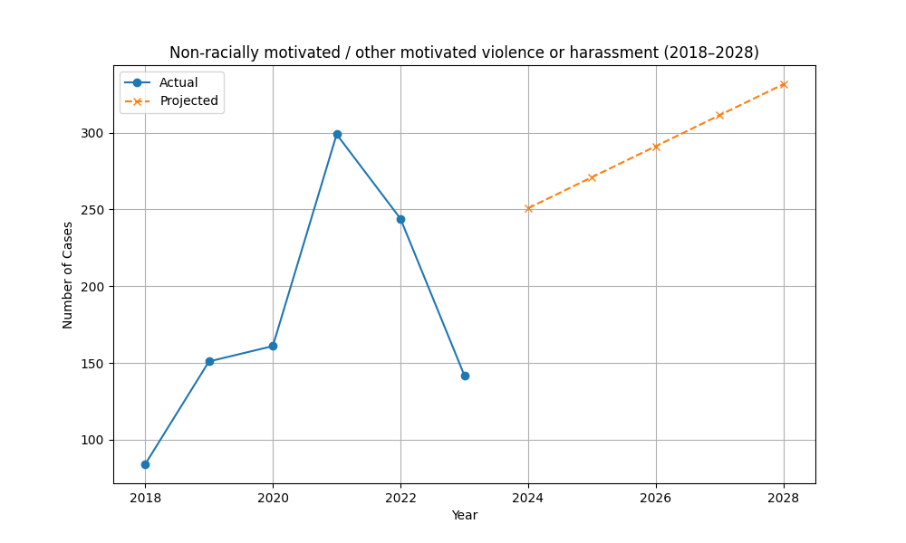
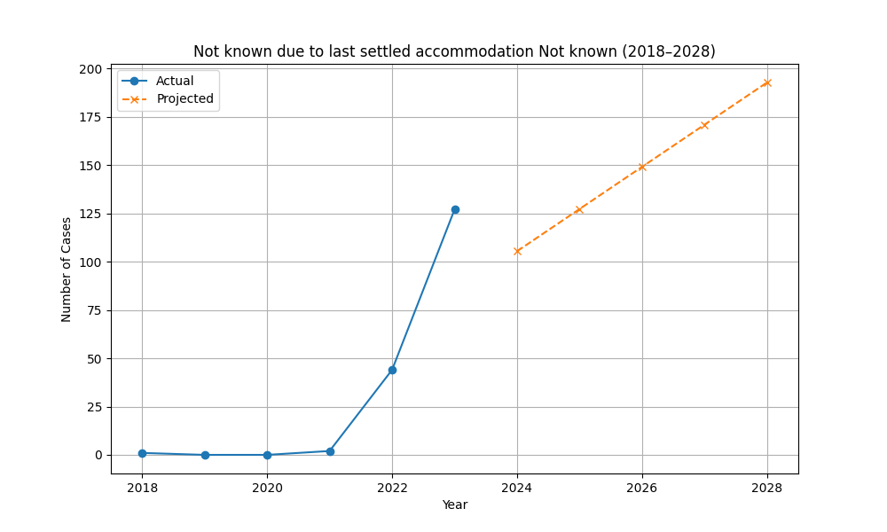
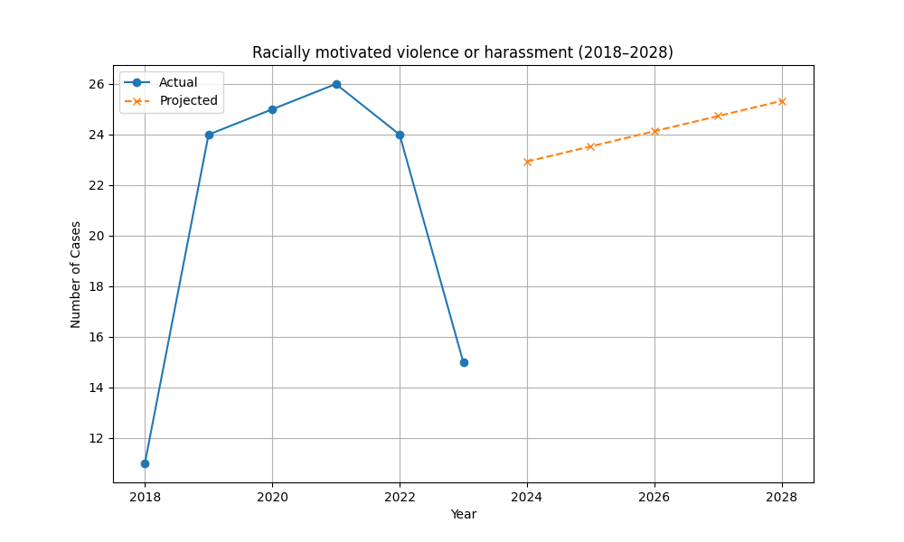
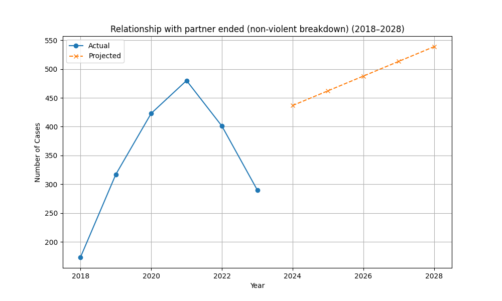

# Homelessness Data Analysis (2018–2023)

This project analyzes the main reasons for homelessness from 2018 to 2023 and projects trends for the next five years (2024–2028).

## 📊 Dataset
The dataset includes annual counts for various reasons leading to homelessness.

## 🔮 Insights from Trend Projections (2024–2028)
- **Domestic abuse – victim** is projected to **increase** by 1078 cases from 2023 to 2028.
- **End of private rented tenancy – assured shorthold tenancy** is projected to **increase** by 1113 cases from 2023 to 2028.
- **End of private rented tenancy - not assured shorthold tenancy** is projected to **increase** by 159 cases from 2023 to 2028.
- **Family no longer willing or able to accommodate** is projected to **increase** by 897 cases from 2023 to 2028.
- **Fire or flood / other emergency** is projected to **increase** by 36 cases from 2023 to 2028.
- **Friends no longer willing or able to accommodate** is projected to **increase** by 215 cases from 2023 to 2028.
- **Non-racially motivated / other motivated violence or harassment** is projected to **increase** by 189 cases from 2023 to 2028.
- **Not known due to last settled accommodation Not known** is projected to **increase** by 65 cases from 2023 to 2028.
- **Other (Retired)** is projected to **decrease** by 658 cases from 2023 to 2028.
- **Racially motivated violence or harassment** is projected to **increase** by 10 cases from 2023 to 2028.
- **Relationship with partner ended (non-violent breakdown)** is projected to **increase** by 248 cases from 2023 to 2028.

## 📈 Visualizations
Each chart includes actual data and projected values:

- 
- 
- 
- 
- 
- 
- 
- 
- .png)
- 
- 
